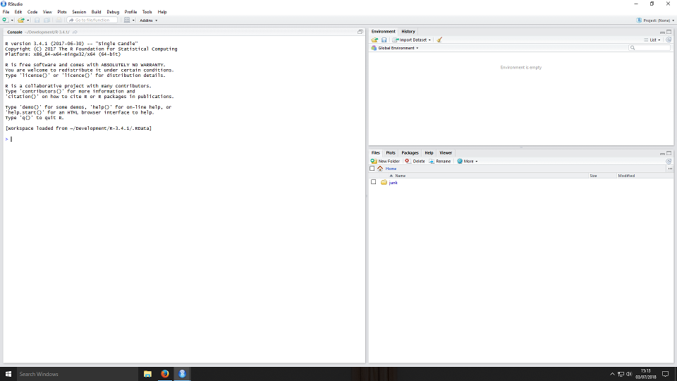
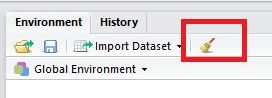
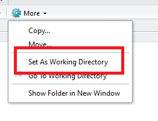

```{r setup, include=FALSE}
library(learnr)
library(tidyverse)
# library(reticulate)
knitr::opts_chunk$set(echo = FALSE)
```

## Introduction

This is an introduction to the use of R with RStudio for data analysis.  It is not an introduction to R generally, and some topics that would always be covered in such a course are treated only very briefly here: building vectors and matrices; writing functions; vectorised mathematics and so on.  Instead we concentrate on data management and analysis tasks.

I think you can usefully follow this tutorial even if you haven't learned to program in R.  We will take a little time to learn the very basics and also to learn about RStudio.

### Tips about using the learning material

You should work though the material progressively - it is cumulative and deliberately sequenced.  (The left hand menu will show you which parts of the course you have completed).

As well as exercises you can carry out while following the learning material, you will also begin to develop an R script.  I will give you instructions on what to include as we go.  You should learn to use the RStudio editor as you write the script.

Throughout you are asked to run snippets of R code.  You can write code directly into the course web pages and click a **run code** button to execute it.  The run boxes usually have a **solution** button to see the correct code and a **start over** button to start again from scratch.

Where you are required to write code, I have tried hard to scaffold the method required for you so that you can work out what the code should look like.  In almost all cases, in case my scaffolding fails, I have provided the code solution to these exercises and in this way, you should not miss out on any steps that have a cumulative effect.

## R the Very basics with RStudio

### The RStudio IDE

RStudio is an application that combines in one interface an editor for R programs; access to the R language interpreter; file, help and graphs browser; and a history and data environment viewer.  The first time you start RStudio it should look something like this:



You can use the RStudio IDE to do on-the-fly computations in R; to write R language scripts to automate analysis tasks; and to write reports and presentations in the RMarkdown language.

The main elements of the application are called **panes**.  On the left taking up the height of the whole screen is the **console**.

Both right hand panes are **tabbed**.  On first start-up, the top pane opens to the *environment* tab.  This gives you a view of any data objects in memory in the current R session.

The **history** tab is a list of commands executed in the console in the current session.

You can view data objects and commands in history and you can clear out items from the environment or history.

The lower of the two right hand panes shows a number of tabs each of which is a browser, for files, plots you create, packages installed, help files and web content.

##### The console

The console is where the R language interpreter runs.  You can use the console interactively to compute things.

You can for example compute $2 + 2$ like this (the result appears after you press enter.)

```{r simplesum, echo=TRUE, exercise.eval=TRUE}
2+2

```

##### The data environment

It is always important to keep watch on what is in the data environment and to know how to clear it when necessary.

You can remove all data objects from memory with the brush icon.



##### The file browser

The file browser shows you files and folders stored locally.

When you work on an R project you will need to be sure that your script executes in the correct working directory.  You can use the *more* gear icon to set this.



R will look for files of data, or images, or scripts in the *current working directory* and if it does not find them then your project may fail to execute.

Later you will learn how to set the working directory programmatically so that you can be sure your script will run correctly.

##### The viewer

The viewer tab is where you can preview web content that you produce, for example web pages generated by RMarkdown scripts.

##### The plots tab

This tab is where plots are previewed.  They are not saved by default and you must either save them in your scripts or use the export button to save them outside of the IDE.

##### The packages tab

One of the great features of the R language, is the large collection of *pakages* - user contributed extensions to the base R language.  There are packages for all sorts of tasks, from sophisticated statistical routines, to software helper tools, to integration with other software systems (for example, git).

This tab shows you which R *packages* are installed.  We will talk about packages a little later.


##### the help tab

This is where help is shown for you.  You can use a search tool bar in the pane or you can search from the console.  To search for a function or procedure that you know you can type

```
?function-name
```

Of if you are unsure of the name, you can use a keyword search:

```
??keyword
```

##### Adding a source pane

You will almost always work with one other pane that does not show by default on start-up: the *source* pane.

The source pane is where you edit R scripts and other documents, such as reports or presentations written in Rmarkdown.

It is very good practice dealing with source files that you save them as soon as you create them.  You should also be careful to always save a file with the correct extension.  The extensions you will most commonly use are

|File extension|Use|
|--------------|---|
|.R|for R scripts|
|.Rmd|for RMarkdown files|

#### Tools and preferences

The RStudio tools menu has some important functions.  Perhaps the most useful at the start is the *install packages* dialog which provides you with a graphical interface for installing packages.

Later you should explore the *global options* which will allow you to customise your editor for example or change the default layout of windows and panes in the IDE.


## Computing at the console

As we learned above the console provides interaction with the R language interpreter.  You can issue commands and R will respond (as long as the command is understandable!)

#### Arithmetic

Try the following code lines, making sure that the answers are correct.

```
3*7

3*7+2

3*(7+2)

```
```{r additiontask, exercise=TRUE, echo=FALSE}


```

Some arithmetic operations are achieved by calling *functions*.  A function is a named operation followed by the data to operate on in parentheses.

Try the following code where we use both *operators* (like ^) and functions (like sqrt() and mean()).  The notation 1:10 is understood as the sequence of numbers beginning with one and ending with ten.

```
2**2
2^2
sqrt(4)
mean(1:10)
```

```{r moremaths, exercise=TRUE, echo=FALSE}

```

R also has some built in values, useful constants such as *pi*.  Can you identify the following values?

```{r specialnumbers, exercise=TRUE, exercise.evaluate=TRUE}

pi

exp(1)

1i

```

If you are unsure try googling to find out.

## The first lines of your script

An R script is just a text file containing R code.  You can plan your analysis, put the commands in a script and then execute the script; check the output; edit the script if corrections are necessary.

You should normally name your scripts to end **.R** (Later we will write R report files using **.Rmd** instead, but for now, use **.R**).

In a script, a line that begins **#** is a comment and will be ignored when the script is executed.  You should use comments in your scripts, especially as a beginner, to explain what your code is doing.  As you progress in R programming your comments will change. Rather than explaining  your code (which should really be self-explanatory), your comments will address other programmers who may need to know about any unusual behaviour or requirements.

Make a folder on your hard drive to store this project's scripts.  I will use this folder: **C:/Users/ccaaj/FirstRProject**Create a new script file in RStudio.  Save it with the name **FirstProject.R**.

Eventually, you will be creating scripts as parts of projects, but for now your script is standalone.  For that reason, we will add two lines of housekeeping code:

```
# set the correct working directory for the project
setwd("~/FirstRProject")

# remove any data objects in the current workspace
rm(list = ls())
```

Add these lines and the comments now.  Save the file in the project folder.  Now use all the power of google to find out what the R function **rm()** does and what the parameter **list = ls()** means.


## Variables

There is a good introduction to basic data types to supplement this brief guide at [The R-Tutor Introduction to R](http://www.r-tutor.com/r-introduction).

##### What is a variable?

In data analytics and statistics, a variable is simply something that you measure or count - it may be a thing such as the women in a group, a characteristic of a thing such as the eye colour of the men in a group, or a quantity such as the age of children in a neonatal ward.

In programming, including R programming, variable has an additional meaning.  A variable, informally, is a name we can use to refer to a piece of information in computer memory.  Examples might include today's date; the dollar to pound exchange rate; the vat rate.  We can assign to any value (numeric or otherwise) a name by which we can then refer to it.

##### What is variable assignment?

If we want to take the current temperature (it is a round 17$^\circ$) and assign it the name `curtemp`, we write

    curtemp <- 17

Now, if we find that it has increased by one degree, we can write either

    curtemp <- 18

or

    curtemp <- curtemp + 1

both of which have the same effect.

##### Vectors and matrices

Vectors are collections of values of the same kind (think all strings or all numbers).  A vector in the simplest case is a single row of values (or column, but R doesn't care in the case of simple vectors).  So I can create a vector of the integers one to ten like this

    myvector <- 1:4

using the colon notation (:) to indicate a sequence.

Of course not all vectors are sequences, so we have a function **c()** (which people often pronounce 'collection').  So

    myothervector <- c(2, 4, 6, 8)

<!-- cbind() -->

Now that we have two vectors, we can use them to create a matrix.  There are two choices:

 1. each of the originals can treated as a column in the new matrix;
 2. each of the originals can treated as a row in the new matrix;

Here is the code to create new matrix from columns:

    colmatrix <- cbind(myvector, myothervector)

Run the three lines of code in this section on the RStudio console and then examine **colmatrix**.

### Exercise: bind two vectors to a matrix as rows

The previous code example bound the two vectors as columns.  There is a function **rbind()** which binds vectors together as rows.

Write the line to bind **myvector** and **myothervector** as rows in a matrix called **rowmatrix** and examine the result.

```{r prepare-vectors}

myvector <- 1:4
myothervector <- c(2, 4, 6, 8)

```

```{r rowbind, exercise=TRUE, exercise.setup = "prepare-vectors"}
rowmatrix <- rbind(myvector, myothervector)
```

```{r rowbind-solution}

rowmatrix <- rbind(myvector, myothervector)

```


To specify the **dimensions** of a matrix, we first give the number of rows in the matrix followed by the number of columns.

```{r dimrowmatrix, echo=FALSE}
question("What are the dimensions of rowmatrix?",
				 answer("2,1"),
				 answer("4,2",message="Almost, this is columns followed by rows!"),
				 answer("2,4", correct = TRUE),
				 answer("2,2"),
random_answer_order = TRUE,
allow_retry = TRUE
)
```

#### More sequences

We have already created a vector as a sequence.  We can use a different method when we want to control the increment of the vector.

    myincrement <- seq(1,10,2)

The resulting matrix will have only five elements: 1, 3,5,7,9

The first parameter in the function **seq()** is the start number, the second is the upper limit of the sequence and the last is the step or increment.

### Exercise: creating a vector as a sequence

Use **seq()** to create a vector called **bythreesto99** that begins with zero and increases by three with each item, until a limit of 99 is reached.

```{r increvect, exercise=TRUE}


```

```{r increvect-solution}

bythreesto99 <- seq(0,99,3)

```

## Finding elements in vectors and matrices

Imagine a simple vector of numbers:

    x<-1:10

And now, let's square the elements:

    x<-x^2

We can **address** individual parts of **x** using the **index**: the index of a vector in R starts at one and we write it

    x[1]

We know that **x** has ten columns.  So can find the last element of **x** with

    x[10]

If we have the matrix **mymatrix**

<!-- |   | 1 | 2 | 3 | -->
<!-- |---|---|---|---| -->
<!-- | 1 | 1 | 4 | 7 | -->
<!-- | 2 | 2 | 5 | 8 | -->
<!-- | 4 | 3 | 6 | 9 | -->

\begin{equation*}
mymatrix =
\begin{pmatrix}
1 & 2 & 3 \\
4 & 5 & 6 \\
7 & 8 & 9
\end{pmatrix}
\end{equation*}

We notice that it has potentially two ways to address each element.  If we try

    mymatrix[8]

and

    mymatrix[2,3]


We see that the first example with a single index is counted top-down, left-right to pick the sixth element from the matrix.  The second, specifies two indices the second row and third column.  These are the same element.

You see in the following example that we can use a **sequence** in the row and column specification to extract a sub-matrix:

    	mymatrix[2:3,2:3]

gives

         [,1] [,2]
    [1,]    5    8
    [2,]    6    9

### Exercise: extracting elements of a vector or matrix

Create the vector **x** as the sequence of numbers 1:10.  Create **xsquare** as a vector containing the values of **x** squared.  Use **rbind()** to create a matrix **xmat** of these two vectors.

Having created this new matrix, extract the sub-matrix

            [,1] [,2] [,3]
    x          3    4    5
    xsquare    9   16   25

```{r extraction, exercise=TRUE}


```

```{r extraction-solution}
x<-1:10
xsquare <- x^2
xmat <- rbind(x,xsquare)
xmat[1:2,3:5]
```
## Selection with logical comparisons

Selection from a vector or matrix involves identifying the data object and then using the square brackets ([,]) to pass either an index or some selection criteria.  If I have the vector

    myvector = (1,2,3,4,5,7)

Then

    myvector[myvector<5]
    
extracts the vector

    (1,2,3,4)

Try the following code snippet:


```{r logicomp, exercise=TRUE}
newvector <- 1:100

uppervector <- newvector[newvector>50]
uppervector

evenvector <- newvector[(newvector%%2)==0]
evenvector

```
Write an explanation for these two selection statements which I will ask you to share in our online session.

## The end of our basic introduction

Well, this has been something of a whilrwind tour.  I am not going to introduce more of the basic R language now.  There are a number of excellent tutorials that you can try if you want to take your knowledge of R itself futher.  In no particular order:

 * [R for Data Science by Hadley Wickham](http://r4ds.had.co.nz/)
 * [Advanced R Programming by Hadley Wickham](http://adv-r.hadley.nz/)
 * [Quick-R by DataCamp](https://www.statmethods.net/index.html)

## Beginning data analysis

In the rest of this tutorial we will learn how to:

 1. read data from a local or remote file into an R data object
 2. check and correct the types of variables in our data
 3. create new variables from old
 4. select subsets of data meeting various criteria
 5. create models of our data

But before any of this, a reminder about **R packages**.

Packages are libraries of R code that extend the functionality of base R in various ways.  For example, the package **ggplot2** provides a simple framework for producing high quality graphs in R.

There are some packages used by almost all R data analysts because they are so useful.  Among these are the packages of the [tidyverse](http://www.tidyverse.org).

The **tidyverse** package includes functions for data manipulation and management and plotting (and indeed more).  I have already loaded the package for this tutorial and we can use some of its functions right from the start.

## Reading remote data files

There are several R functions to read data from a file.  They are specialised according to the format of the data file.

Perhaps the simplest is a plain text file with observations or cases in rows and variables separated by either spaces or tabs.  These files are read with **read.table()**


If the file is held on a remote web server, then the argument passed to the function must be the full URL that leads to the file.  Here is an example of its use

```
mydf = read.table("http://www.ucl.ac.uk/~ccaajim/results.txt")
```

This example code reads the file and stores the contents in an object called __mydf__

The file _*results.txt*_ doesn't exist at this address, so this code would fail.

Instead, the data we will use is in the *comma separated values* format.  It is located on a remote web server at the URL http://www.ucl.ac.uk/~ccaajim/results.csv

Although there is a base R function to do the job, we will use the tidyverse function to read this file: _**read_csv()**_.


### Exercise: reading a data file

Write and run the R code that will read the data from the file in the URL above and store it in an object called _resultsdf_.

```{r readresults, exercise=TRUE}


```

```{r readresults-solution}

resultsdf <- read_csv("http://www.ucl.ac.uk/~ccaajim/results.csv")
```

```{r resultsresults, echo=FALSE}
suppressMessages(resultsdf <- read_csv("http://www.ucl.ac.uk/~ccaajim/results.csv"))
```
Notice that this displays a summary of the data parsed when it completes.

## More lines for your script

Add the lines

    #load packcages for data analysis
    library(tidyverse)
    library(psych)
    library(moments)

    #read remote datafile
    resultsdf <- read_csv("http://www.ucl.ac.uk/~ccaajim/results.csv")

to your growing script.

Find the documentation for each of these library packages on **CRAN** and also look at their help pages.  When you have successully read in the data, check to see if any values in your data are greater than 80.

## Viewing data in RStudio

The code you wrote to read the data results in a *tibble*: a modern take on the classic data table.   If our data is properly set out, each row is a case and each column is a variable.  This data is not quite properly [_tidy_](https://en.wikipedia.org/wiki/Tidy_data) but it will do.

Now that you have created the data object, you can view the first few lines of data with __*head()*__.

```{r headresults, echo=TRUE}
head(resultsdf)
```

You should also try the R command __*View()*__ which opens an attractive view of your data object in its own tab.  Notice that __*View*__ has a capital V.

## Checking the structure of your data

Data can be numeric or text, it may be integer data or it may it may involve fractional values (like the rational numbers).  Text data may be represented as characters or as strings of characters.

When you import data, R will try to work out what the correct representation is.  It will certainly recognize obvious strings and numbers, but sometimes you may want to check, especially because R will not always recognize the correct **level of measurement**.

As well as having a data type (such as text or numeric) variables may also be distinguished as *continuous* scores (on the interval or ratio scales) or *factors* (categorical data, both nominal and ordinal).

In R, the important distinction is between factor and non-factor data, and within factors between *ordered* and non-ordered data.

Now that you have downloaded the data set, you can check its structure.  First, use the function _**names()**_ to find out what the variables in your data set are called.

### Exercise: getting variable names

```{r prepare-namestask}
resdf <- read_csv("http://www.ucl.ac.uk/~ccaajim/results.csv")
```

```{r namestask, exercise=TRUE}

```

```{r namestask-solution}
names(resultsdf)
```

```{r namesquiz, echo=FALSE}
question("which of the following is *not* the name of a variable in this dataset?",
				 answer("surname"),
				 answer("age", correct = TRUE),
				 answer("gender"),
				 answer("teacher"),
				 incorrect = "No, that's definitely in the dataset.",
				 allow_retry = TRUE,
				 random_answer_order = TRUE
)
```

You can get more detail about the variables in your dataset with the **str()** function.  Use this function to inspect **resdf**.

### Exercise: the structure of the dataset

```{r strtask, exercise=TRUE}

```
```{r strtask-solution}

str(resdf)

```
### Exercise: answer the following question.

```{r factortask, echo=FALSE}
question("Which of the variables are currently factors?",
  answer("surname",message = "This is a string variable, but with one value for each row in the data, it is not likely a factor."),
  answer("gender", message="This variable probably should be factor but currently is not."),
  answer("teacher", message="This variable probably should be a factor but currently is not."),
  answer("All of the above",message="These variables probably should all be factors but currently only one is."),
    answer("None of the above",correct = TRUE,message="These variables probably should all be factors but currently none is."),
allow_retry = TRUE
)
```

### Exercise: a glimpse at your data

There is a tidyverse function __*glimpse*__ which provides similar output but a little tidier.  Try it below.

```{r glimpsetask, exercise=TRUE}


```

## Transforming and creating variables

### Setting up factors

As we saw earlier, the two variables *gender* and *teacher* should be understood as factors but are currently identified by R as integer data.

This is important, because if we were to do a regression analysis, for example, with *gender* as an independent variable, R would treat it as numeric giving quite the wrong results.

To correct this, we will take the data set *resultsdf* and modify it by *mutating* the variable *gender*.  There is an R function __*as.factor()*__ that takes a numeric variable and [*coerces*](https://en.wikipedia.org/wiki/Type_conversion) it to be a factor.

Our process will be to select the dataset results and then *pipe* it to the tidyverse function __*mutate*__, and instruct __*mutate*__ to use __*as.factor()*__ to convert it to a factor.

**Piping** is the action of sending the output of one R operation through to another R operation; through a pipe so to speak.  We write pipe like this: %>%.  If you are reading your code and it contains a pipe, it is helpful to read the pipe symbol as __*then*__.

So, first select the data set just by naming it, pass it through a pipe to mutate:

```{r firstpipeexample, echo=TRUE}
resultsdf %>%
    mutate(gender=as.factor(gender))
```

But this operation does **not** modify *resultsdf*.

Try this code in the run-box below and add a call to _**str()**_ to check the result.


```{r mutatefirsttask, exercise=TRUE}

```

To modify our dataset we need to make R run this operation and write the output to a data object.  In this case, we want R to **overwrite** the existing object *resultsdf*.

Assignment of a value to a name is with the <- operator.  So the code will look something like this:

```
thedataset <- thedataset %>%
    mutate(variablename=as.factor(variablename))
```

Can you modify this example code to correctly transform the *gender* and *teacher* variables to factors?  Try below.

```{r mutatesecondtask, exercise=TRUE}


```
```{r mutatesecondtask-solution}
resultsdf <- resultsdf %>%
	mutate(gender=as.factor(gender)) %>%
	mutate(teacher=as.factor(teacher))
```

### Creating summary variables

For each student we know their scores out of 100 in each of three tests: Maths, English and History.  It would be useful to have a variable that summarizes their overall performance.  A good candidate in this case is the *average* or *mean*.  There are two ways we could calculate this in R.  The first way is to do the maths ourselves:

```
average_exam = (maths + english + history)/3
```
In order to get the desired result, we will want to start with the tibble, *resultsdf* pipe it to a statement that will *select* which columns we want and pipe this subset of columns to a *mutate* statement.

Since the first method above is so simple, in this case we could certainly use it.  But we will try out the second method so as to build familiarity with the use of *pipes* and tidyverse functions.

The code should have this structure:

```
mytibble %>%
	mutate(new_value = arithemetic)

```

See if you can write the code that will create this new variable - *average_exam* - for our *resultsdf* dataset.  Add a command to R to view a few lines of the data after your mutation.

```{r avxmtaskone, exercise=TRUE}

```

```{r avxmtaskone-solution, echo=TRUE}
resultsdf <- resultsdf %>%
	mutate(average_exam=(maths+english+history)/3)

head(resultsdf)

```

In my solution, I added a call to head so that we can eyeball the results.

Of course, you can use any mathematical procedure to *mutate* a new variable.  You could for example take the log of a skewed variable if you wished.

## Generating a new ranking variable

```{r prepare-results,message=FALSE, echo=FALSE}
resultsdf <- read_csv("http://www.ucl.ac.uk/~ccaajim/results.csv")
resultsdf <- resultsdf %>%
	mutate(gender, factor(gender))
resultsdf <- resultsdf %>%
	mutate(teacher, factor(teacher))
resultsdf <- resultsdf %>%
	mutate(average_exam=(maths+english+history)/3)
resultsdf<-resultsdf %>%
	mutate(average_exam = round(average_exam)) %>%
	mutate(stream = factor(cut(average_exam,
														 breaks = c(0,49,59,100)),
												 ordered = TRUE,
												 labels =  c("three","two","one")))

myvector <- 1:4
```


We will now create a new variable based on the *average_exam* variable just created.

We want to *cut* the continuous variable *average_exam* into three, distinct categorical levels which are ordered.  This is just like awarding bronze, silver or gold medals based on times in an Olympic sprint.

We will once again overwrite *resultsdf* with a new version containing this mutated variable.  The calculation in the *mutate* clause can be done with the R function _*cut()*_.

_*cut()*_ takes some data and a set of break points and uses the break points to divide the scores into a set of ordered groups.

Let's experiment.  We can create a vector of integers one to ten and cut it with into three groups.

There are two ways in which this could be done.  First we can use a *conditional* R language structure:


```
vec <- 1:10

cutvec <- ifelse(vec>=6,1,
    ifelse(vec<5,3,
    2))

head(rbind(vec,cutvec))
```

Or we can use the _*cut()*_ function:

```
vec <- 1:10

cutvec <- ordered(cut(vec, breaks = c(0,4.99,5.99,10)))

head(rbind(vec,cutvec))

```

It may help to think of this as a way of writing three pairs of *floor* and *ceiling*, where the value specified by floor is *excluded* from that interval and the value specified by ceiling is *included* in the interval.


The result of cut is a *factor*, but it is not ordered.  To make it an ordered factor, we must wrap the cut expression inside the function _*ordered*_.  Try this below for *cutvec* described in the above example, but with values one to one hundred.

```{r cutexercise, exercise=TRUE, exercise.setup = "prepare-results"}

```

```{r cutexercise-solution}
vec <- 1:100
cutvec <- ordered(cut(vec, breaks = c(0,49,59,100)))
head(rbind(vec,cutvec))

```

Our task is very similar, we must create an ordered variable from a cut of the average exam scores.

If we have integer values for *average_exam* this will be easy.  We don't and so we should *round* the variable before we cut it.

So, cut *stream* into three ranks, those below fifty, from fifty to fifty nine and those above 60.  Ensure that the result is ordered with labels, *three*, *two*, *one*.


```{r stream, exercise=TRUE, exercise.setup = "prepare-results"}


```

```{r stream-solution}

resultsdf<-resultsdf %>%
	mutate(average_exam = round(average_exam)) %>%
	mutate(stream = factor(cut(average_exam,
	                breaks = c(0,49,59,100)),
                    ordered = TRUE,
                    labels =  c("three","two","one")))

head(resultsdf)

```

## Creating subsets of data

It is often useful to create subsets your data.

### Selecting rows

We will first look at creating subsets by selecting rows.  We will pass the **resultsdf** data through a pipe ``` %>% ``` to the **filter** verb (or procedure if you prefer), setting the criterion for inclusion in the subset to be gender is 1.  The result will be saved in a tibble called **fstudents**.  Here is the code:

```
fstudents <- resultsdf %>%
	filter(gender==1)

fstudents
```
And here is the result:


```{r}
fstudents <- resultsdf %>%
	filter(gender==1)

fstudents
```

## Exercise: simple selection by row criterion

Modify the example selection code so as to select only the students where gender = 1.

```{r selectrowsone, exercise=TRUE, exercise.setup = "prepare-results"}


```
```{r selectrowsone-solution}
fstudents <- resultsdf %>%
	filter(gender==1)

fstudents

```

## Exercise: selection by compound criterion

Modify the example selection code so as to select only the students where gender = 2 and teacher = 2.

```{r selectrowstwo, exercise=TRUE, exercise.setup = "prepare-results"}


```
```{r selectrowstwo-solution}
fstudents <- resultsdf %>%
	filter(gender==2 & teacher == 2)

fstudents

```

